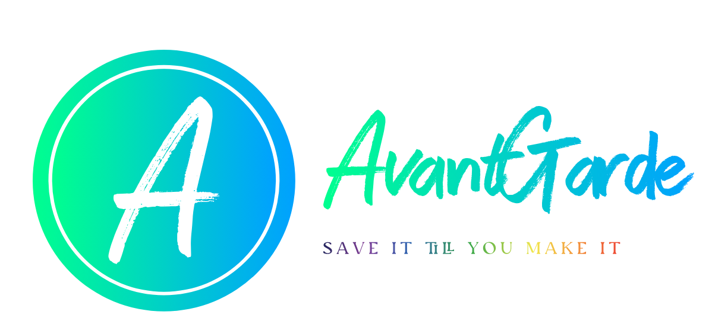
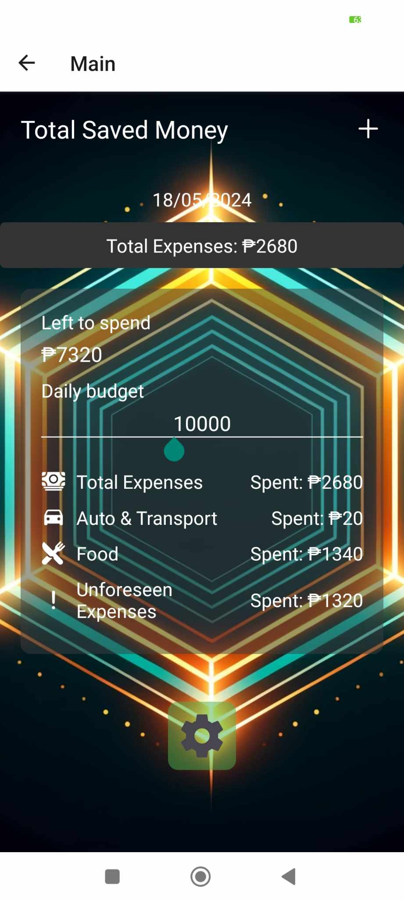
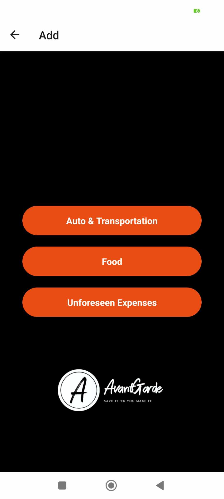

# Development of a Budget Tracking Mobile Application

Welcome to the **Development of a Budget Tracking Mobile Application** repository. This mobile application is designed to help users effectively manage their daily budgets by tracking their spending across different categories.

## Features

### Daily Budget Calculation
- **Set a Daily Budget**: Users can set a daily budget that they aim to stick to.
- **Real-time Updates**: The app updates the remaining budget in real-time as expenses are added.

### Expense Tracking
- **Auto & Transport**: Track expenses related to transportation, fuel, car maintenance, etc.
- **Food**: Monitor spending on groceries, dining out, and other food-related expenses.
- **Unforeseen Expenses**: Keep track of unexpected expenses that arise.

### Total Expenses Management
- **Total Expenses Calculation**: The total expenses from all categories are calculated and displayed.
- **Budget Deduction**: The total expenses are deducted from the daily budget, and the remaining amount is shown as 'Left to Spend'.
- **Visual Representation**: Users can easily see how much they have spent and how much is left in their budget.

### User-Friendly Interface
- **Intuitive Design**: The app features a simple and intuitive design that makes it easy to navigate.
- **Visual Aids**: Graphs and charts help users visualize their spending patterns.

## Screenshots

*Main screen showing daily budget, total expenses, and categories*

*Screen to add expenses in different categories*

